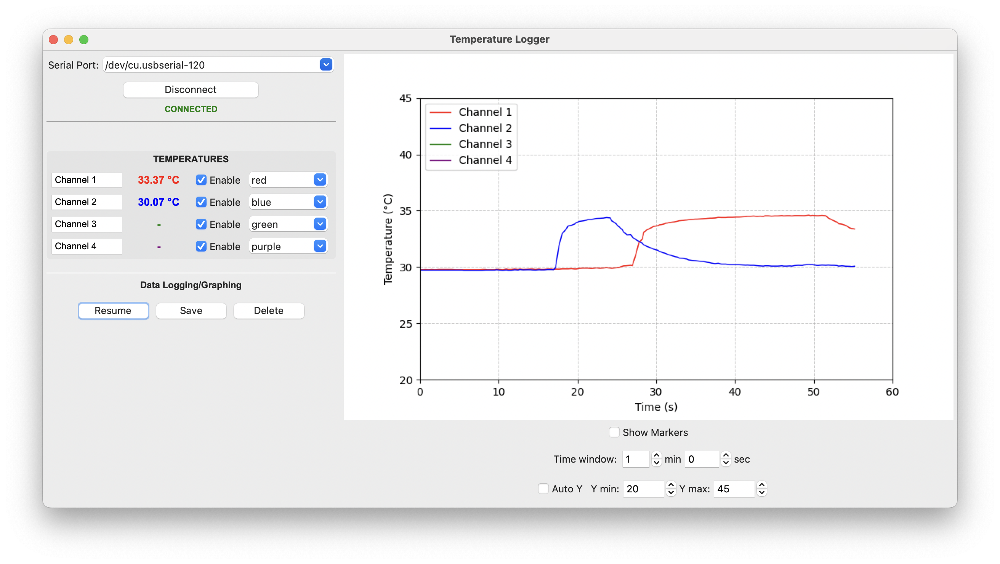

# ut325f
A python datalogger program for the UNI-T UT325F 4 Channel Thermometer

[https://meters.uni-trend.com/product/ut325f-4-channel-thermometer/]

There are two files in this repository: 

1. ut325f_print.py : This file prints the temperatures continuously to the console
2. ut325f_gui.py : This is a tkinter a user interface. See image below.

