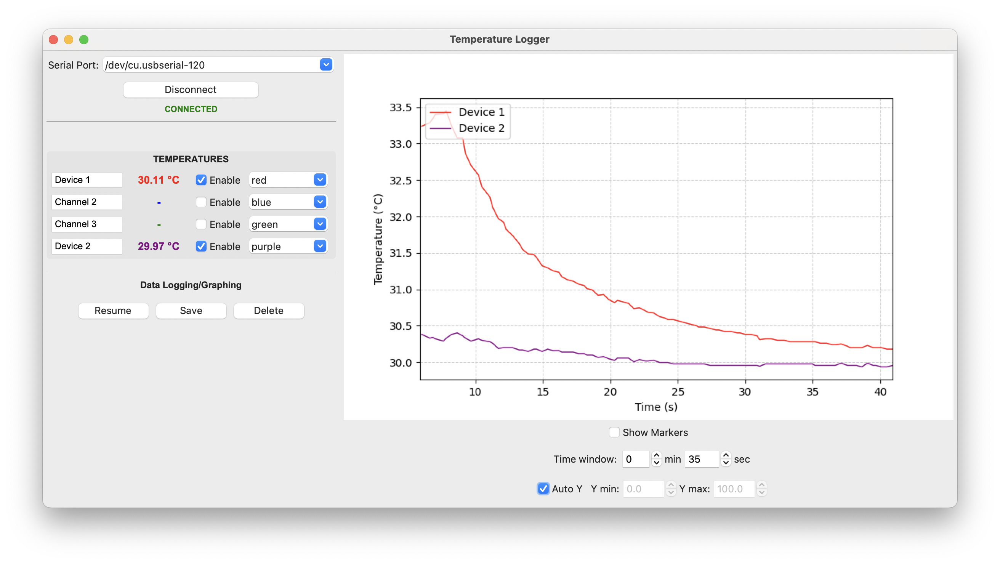
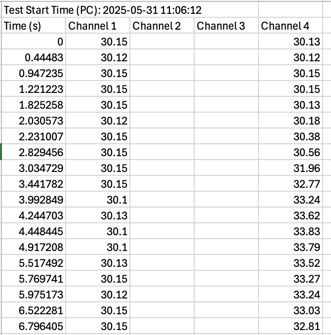

# ut325f
A python datalogger program for the UNI-T UT325F 4 Channel Thermometer

[https://meters.uni-trend.com/product/ut325f-4-channel-thermometer/]

There are two files in this repository: 

1. ut325f_print.py : This file prints the temperatures continuously to the console
2. ut325f_gui.py : This is a tkinter a user interface. See image below.

* The temperature channel labels and colours of the graph can be updated as needed.
* The Y-axis limits can automatically adjust or set manually as required
* The time axis rolls based on the time-window set.
* The save button will save the data to a csv file.

The CSV file records the computer time on the first line. Then it records relative time in seconds from there.

